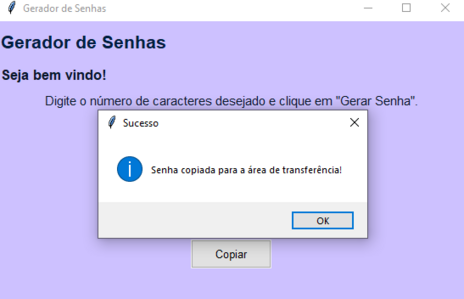

<br/>
<h1> GERADOR DE SENHAS 📌</h1>
<p> O projeto foi realizado com o intuito de praticar e consolidar conceitos. <br/> Tópicos Visitados: Strings, Funções, Docstrings, Tratamento de Exceções, Bibliotecas e Módulos.  </p>

<h2>☕ Descrição: </h2>

-  Uma ferramenta que pode ser usada para criar senhas seguras ao registrar-se em serviços online ou proteger dados confidenciais.

<br/>

<div align="center">
      
</div>

<h2> 💻 Pré Requisitos </h2>

#### Este projeto requer **Python 3.7 ou superior** e as bibliotecas 'tkinter', 'random' e 'string'.<br/>
As dependências do projeto estão listadas no arquivo requirements.txt.

<h2>🍄 Usando o Gerador de Senhas </h2>

1. O usuário deve inserir na caixa de entrada a **quantidade de caracteres** desejada.  
2. Clique no botão **"Gerar Senha"** para obter uma senha forte.  
3. Caso queira utilizar a senha, clique no botão **"Copiar"** para copiá-la diretamente para a área de transferência.  

## Execução
1. Clone este repositório.
```bash
git clone https://github.com/seu-usuario/seu-repositorio.git

